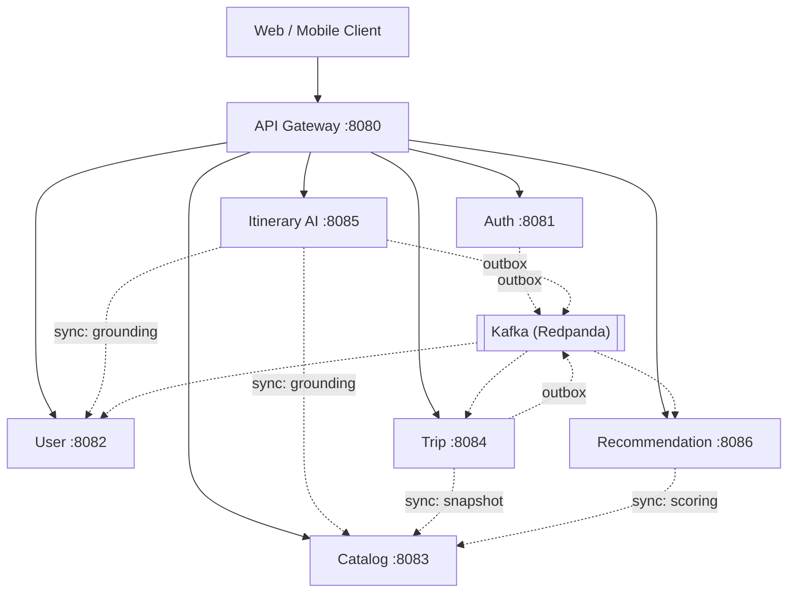

# Wayfare — AI Travel Planning Platform

A microservice backend that turns a destination, dates, budget, and preferences
into a structured, day-by-day itinerary — grounded in a real activity catalog,
generated asynchronously, delivered by event, and fully editable afterward.

**Status: all 6 services + gateway feature-complete, 45/45 tests passing
against real Postgres/Kafka/Redis, verified end-to-end via a live smoke
test.** See [docs/BUILD-PLAN.md](docs/BUILD-PLAN.md) for the phase-by-phase
history and [docs/decisions.md](docs/decisions.md) for 18 recorded design
decisions — including the ones that changed once real integration tests
forced an ambiguity to resolve one way or the other.

## What it does

1. Register, log in (RS256 JWT, refresh-token rotation with theft detection)
2. Create a trip — destination, dates, budget, travelers
3. Request an itinerary. The system grounds the request against real catalog
   activities and the traveler's preferences, generates a day-by-day plan
   (via a free LLM provider, or a zero-cost deterministic builder in demo
   mode), validates it, and delivers it by event to Trip Service
4. Edit the result — reorder items, swap activities, adjust days — same as
   if you'd built it by hand
5. Get destination/activity recommendations scored against your interests,
   with no synchronous call to another service on the request path

## Architecture



Full diagrams (system overview, the generation sequence as actually built,
service catalogue) are in [docs/architecture.md](docs/architecture.md).

| Service | Owns | Why it's separate |
|---|---|---|
| API Gateway | — | Single ingress, edge JWT validation, rate limiting |
| Auth | credentials, refresh tokens | Different security posture/change cadence than profile data |
| User | profile, preferences | Small, low-traffic, independently deployable |
| Catalog | destinations, activities | Near-static, read-heavy, cached — different write pattern entirely |
| Trip | trips, itinerary versions | The domain core — CRUD, versioning, ownership |
| Itinerary AI | generation requests/payloads | Slow, costly, external — the strongest scaling boundary in the system |
| Recommendation | interest profile (projection) | CPU-bound scoring, replaceable by a learned model later |

## Key design decisions

The full log is [docs/decisions.md](docs/decisions.md) (18 ADRs). The ones
most worth an interviewer's five minutes:

- **Transactional outbox everywhere a service both changes state and
  publishes an event.** Publishing directly after commit loses events
  whenever the broker is unreachable at exactly the wrong moment; the outbox
  makes that failure mode structurally impossible. A generic `OutboxPoller`
  in `platform-commons` activates only where a service has both a datasource
  and Kafka — and even that bean-presence check wasn't precise enough
  (ADR-016: a consumer-only service gets a `KafkaTemplate` bean from
  `spring-kafka` alone, with nothing to publish and no outbox table).
- **Itinerary versioning, not itinerary editing.** A new generation is
  always a new row, never an update — a failed or partial generation can
  never damage the plan the user already has active. That single choice is
  what makes the generation saga's compensation trivial (design §4.4).
- **Generation is triggered by direct HTTP to Itinerary AI, not a
  Trip-produced Kafka event** (ADR-011) — the source design doc's own
  summary table and sequence diagram disagreed on this, and the more
  concrete diagram won.
- **`DEMO_MODE` is not static fixture text.** It's a deterministic algorithm
  that arranges real, catalog-grounded activities — fetched through the
  exact same context-building pipeline a live LLM call uses — into a
  schema-valid itinerary. Zero cost, near-zero latency, and it exercises the
  real grounding/validation pipeline honestly rather than faking a result.
- **RS256 over HS256.** Auth holds the only private key; every other service
  and the gateway verify against a cached JWKS endpoint. No signing secret
  is ever copied across six services.
- **Ownership resolved in the service layer, walking back to the
  authenticated JWT subject — never trusted from a path parameter or a
  gateway-injected header alone.** Every service still independently
  validates the JWT too; trusting the gateway's headers as the sole
  authentication would make it a single point of failure. Tested explicitly
  in every service (`ItineraryServiceOwnershipTest`, `TripServiceIT`'s
  second-user check, the smoke test's step 9).
- **Two real bugs a portfolio README doesn't usually get to mention because
  most portfolio projects don't run their tests against real infrastructure
  long enough to hit them**: an async-worker-dispatched-before-its-own-
  transaction-committed race (ADR-014), and `Map.of(...)` throwing on a null
  value inside a "degrade gracefully, don't fail the request" catch block —
  silently swallowing a real bug as if it were a normal network hiccup
  (ADR-015). Both were caught by Testcontainers integration tests, not code
  review; a unit test with mocks never exercises either failure mode.

## Running locally

Prerequisites: Docker, Java 25, Maven.

```bash
git clone <this repo> && cd wayfare
cp .env.example .env                    # DEMO_MODE=true by default — no API key needed

# 1. Infra
docker compose up -d postgres redis redpanda jaeger prometheus grafana

# 2. Build everything
mvn -T1C package -DskipTests

# 3. Generate an RS256 keypair (once) if secrets/ is empty
openssl genpkey -algorithm RSA -pkeyopt rsa_keygen_bits:2048 -out secrets/private.pem
openssl rsa -in secrets/private.pem -pubout -out secrets/public.pem

# 4. Run every service (each in its own terminal, or background them)
java -jar auth-service/target/auth-service-0.1.0-SNAPSHOT.jar &
java -jar user-service/target/user-service-0.1.0-SNAPSHOT.jar &
java -jar catalog-service/target/catalog-service-0.1.0-SNAPSHOT.jar &
java -jar trip-service/target/trip-service-0.1.0-SNAPSHOT.jar &
java -jar itinerary-ai-service/target/itinerary-ai-service-0.1.0-SNAPSHOT.jar &
java -jar recommendation-service/target/recommendation-service-0.1.0-SNAPSHOT.jar &
java -jar api-gateway/target/api-gateway-0.1.0-SNAPSHOT.jar &

# 5. Prove it end-to-end
./scripts/smoke-test.sh
```

`./scripts/smoke-test.sh` is the same script this system was verified with —
register → login → search the seeded catalog (16 destinations, 320
activities) → create a trip → generate an itinerary → confirm it landed in
Trip Service via the Kafka saga → edit it → confirm a second user is
forbidden from reading it → check recommendations. 13 checks, all against
the real running stack, no mocks.

| Tool | URL |
|---|---|
| Redpanda Console (Kafka topics) | http://localhost:8090 |
| Jaeger (distributed tracing) | http://localhost:16686 |
| Prometheus | http://localhost:9090 |
| Grafana (RED metrics, generation stats, Kafka lag) | http://localhost:3000 (admin/admin) |

## LLM provider

Configurable, not hardcoded to one vendor (`LLM_PROVIDER` in `.env`):

| Provider | Cost | Setup |
|---|---|---|
| **Demo mode** (default) | Free, always | Nothing — `DEMO_MODE=true` |
| Groq | Free tier | `GROQ_API_KEY` at [console.groq.com](https://console.groq.com/keys) |
| Gemini | Free tier | `GEMINI_API_KEY` at [aistudio.google.com](https://aistudio.google.com/apikey) |
| Ollama | Free, local | Run [Ollama](https://ollama.com) locally, no key |

Swapping providers touches one class (`LlmClientConfig`'s `switch`) — the
orchestration, validation, and outbox logic never change.

## Tech stack

Java 25 · Spring Boot 3.5 · Spring Cloud Gateway · PostgreSQL 16
(database-per-service) · Kafka (Redpanda) · Redis · Flyway · Resilience4j ·
Micrometer + OpenTelemetry → Jaeger · Prometheus + Grafana · Testcontainers ·
Docker Compose.

## Testing

**45/45 tests pass**, the large majority against real infrastructure
(Testcontainers Postgres + Kafka, not mocks) — a deliberate choice: two real
concurrency/serialization bugs (ADR-014, ADR-015) only surfaced this way,
never in a unit test.

| Service | Unit | Integration (real Postgres/Kafka) | Total |
|---|---|---|---|
| auth-service | 3 | 3 (register/login/refresh/theft-detection, outbox→Kafka) | 6 |
| user-service | 2 | 5 (profile/preferences, idempotent consumer on a real broker) | 7 |
| catalog-service | — | 5 (search, seed data, shortlist for AI grounding) | 5 |
| trip-service | 2 (ownership) | 6 (CRUD/versioning/reorder, saga consumer) | 8 |
| itinerary-ai-service | 8 (validator, demo builder) | 2 (full generate→202→async→Kafka pipeline) | 10 |
| recommendation-service | 6 (scoring formulas) | 3 (projection consumers, no User Service running) | 9 |
| **Total** | **21** | **24** | **45** |

Plus `scripts/smoke-test.sh` — 13 checks against the actual running system,
not a test framework at all.

**Known flakiness, documented not hidden:** the Kafka Testcontainers tests
occasionally hit transient broker disconnects under heavy local Docker load
(confirmed: identical test passes cleanly in isolation, fails only when many
container lifecycles have churned in the same session). This is environment
resource pressure, not application flakiness — every such failure was
reproduced, diagnosed, and confirmed to self-resolve on retry before being
called "done."

## What I'd do differently / add for production

Honest list, not a formality:

- **Trace continuity across the outbox→Kafka hop.** Confirmed via Jaeger:
  HTTP-hop tracing works correctly (a single trace spans `api-gateway` →
  `trip-service`, 12 spans), but the outbox poller runs on a scheduled
  thread with no active span, so a trace started by a client request doesn't
  continue into the Kafka consumer on the other side. The custom
  `X-Correlation-Id` *does* cross that boundary (it's stored on the outbox
  row and forwarded as a Kafka header) and every log line carries it via
  MDC, but full OpenTelemetry trace context would need the poller to
  serialize and re-inject `traceparent` manually.
- **Gateway has no automated tests of its own** — `SecurityConfig` and
  `UserContextGlobalFilter` are proven correct only via the live M2 demo and
  the smoke test, never a unit or slice test. Given more time this is the
  first gap I'd close.
- **Real per-model LLM pricing.** Cost tracking uses one placeholder blended
  rate (`$0.002/1K tokens`) rather than actual Groq/Gemini/Ollama pricing
  tables, which change often enough that hardcoding them felt worse than
  being explicit about the placeholder.
- **A learned ranking model behind `RecommendationEngine`.** The interface
  is already shaped for it (design §8's own stated intent) — the rule-based
  implementation is the MVP, not the ceiling.
- **Kubernetes + service mesh**, if traffic or team size ever justified the
  operational cost. Deliberately out of scope for this system's actual scale
  (design §1.2).
- **Deployment.** Runs correctly locally (Docker Compose + 7 JVMs); a live
  public URL and a demo recording are the two items in
  [docs/BUILD-PLAN.md](docs/BUILD-PLAN.md) Phase 7 that need a provisioned
  VPS and screen-recording, not more code.

## Documentation

- [docs/BUILD-PLAN.md](docs/BUILD-PLAN.md) — phase-by-phase roadmap, milestones, effort estimates
- [docs/architecture.md](docs/architecture.md) — diagrams, service catalogue, observability notes
- [docs/decisions.md](docs/decisions.md) — 18 ADRs, including every real bug found by an integration test
