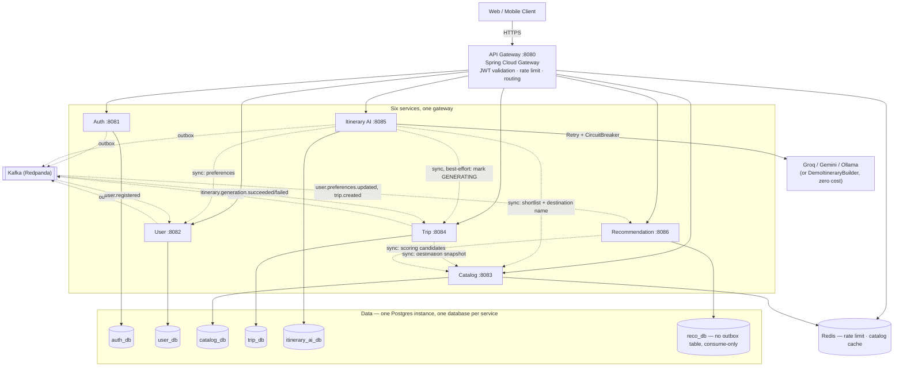
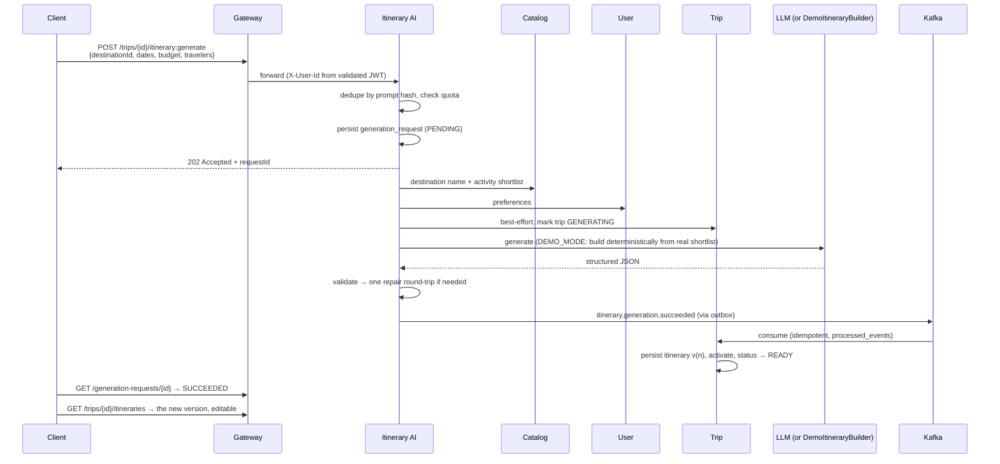

# Wayfare — Architecture

The system as actually built (not the original proposal — see [decisions.md](decisions.md)
for every point where the build diverged from the source design doc, and why).

## System overview

## What changed from the original proposal

The [source design doc](../ai-travel-planner-microservices-design.md) sketched a
6-service system; two decisions changed materially once real code and real
integration tests forced the ambiguity to resolve one way or the other:

| Design doc said | Built system does | Why (full reasoning) |
|---|---|---|
| `POST /trips/{id}/itinerary:generate` triggers via a Trip-produced `itinerary.generation.requested` Kafka event | Client calls **Itinerary AI directly**; trip parameters travel on the request body | [ADR-011](decisions.md) — the doc's own sequence diagram never shows that event; the summary table and the sequence diagram disagreed, and the diagram was more concrete |
| Activity recommendation score includes `proximityToDayCluster` and `closedOnDate` | Those two terms are folded into `rating`/`costFit` or dropped | [ADR-017](decisions.md) — both need data (day-item geocoordinates, activity opening hours) this service doesn't own without an undocumented sync call |

## Generation sequence (as built)

## Service catalogue

| Service | Owns | Scaling reason | Key internal endpoints |
|---|---|---|---|
| **API Gateway** | Nothing (stateless) | Horizontal, CPU-light | — |
| **Auth** | `users`, `refresh_tokens` | Low, spiky at login | `/.well-known/jwks.json` |
| **User** | `user_profiles`, `user_preferences` | Low | `/internal/users/{id}/preferences` |
| **Catalog** | `destinations`, `activities` | High read, cached | `/internal/activities/shortlist` |
| **Trip** | `trips`, `itineraries`, `itinerary_days/items` | Medium, read-heavy | `/internal/trips/{id}/status` |
| **Itinerary AI** | `generation_requests`, `generation_payloads`, `prompt_templates` | Independent — slow, expensive, external | — |
| **Recommendation** | `user_interest_profiles` (projection), `scoring_weights` | Medium, CPU-bound | — |

Every `/internal/**` path is blocked at the gateway (`SecurityConfig` in
`api-gateway`) — reachable only inside the Docker network.

## Observability

- **Tracing**: Micrometer + OTel → Jaeger. HTTP hops correlate correctly (verified:
  a single trace spans `api-gateway` → `trip-service`, 12 spans). The outbox→Kafka
  hop does **not** currently carry OTel trace context — the scheduled poller runs
  on its own thread with no active span, so `itinerary-ai-service`'s outbox
  publish and `trip-service`'s consumption land in separate traces. The custom
  `X-Correlation-Id` (design §3.2) *does* cross that boundary — it's carried
  explicitly as a Kafka header and logged on every line via MDC — but full
  OTel trace continuity across the outbox would need the poller to read a
  stored trace context out of the outbox row and re-inject it (not implemented;
  see "what I'd add for production" in the README).
- **Metrics**: Prometheus scrapes every service (labeled `service=<name>` — see
  `infra/prometheus/prometheus.yml`). `itinerary-ai-service` additionally
  publishes `wayfare_generation_requests_total`, `wayfare_generation_latency_seconds`,
  and `wayfare_generation_cost_usd` — the design's §9.1 "generation success
  rate / latency percentiles / LLM spend" requirement, previously only in the
  database and now in Grafana too (`infra/grafana/provisioning/`).
- **Alerting**: `infra/prometheus/alerts.yml` — generation failure rate, p95
  latency, daily spend threshold, Kafka consumer lag, circuit-breaker open,
  5xx rate, service down.
